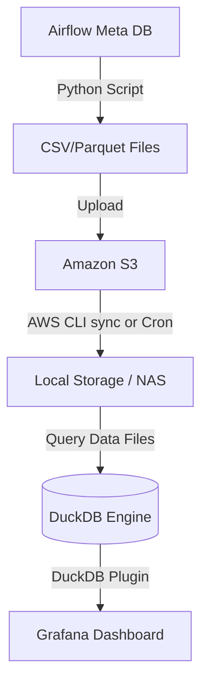

# Airflow Task History Monitoring with Grafana, DuckDB, and S3

이 문서는 `search_co_task_history.py` 스크립트로 추출한 Airflow Task History 데이터를 **Amazon S3**에 적재한 뒤, 이를 로컬 환경으로 내려받아 **DuckDB**와 **Grafana**를 연동하여 모니터링 대시보드를 구성하는 아키텍처 및 추천 대시보드 패널 상세안입니다.

## 1. 아키텍처 개요 (Architecture Overview)



1. **Data Extraction**: `search_co_task_history.py`를 파이프라인화하여 Airflow 실행 이력을 주기적(예: 1시간/1일)으로 추출한 후, `.parquet` 또는 `.csv` 형태로 변환합니다.
2. **S3 Storage**: 추출된 데이터를 Amazon S3(`s3://your-bucket/airflow_audit/`)에 업로드하여 히스토리를 아카이빙합니다.
3. **Local Sync**: Grafana 서버가 위치한 로컬 환경에서 AWS CLI(`aws s3 sync`) 또는 별도의 Airflow DAG를 활용하여 S3의 데이터를 로컬 디렉토리(예: `/var/data/airflow/`)로 동기화합니다.
4. **DuckDB Query Engine**: DB 파일 형태(RDBMS)로 임포트할 필요 없이 DuckDB의 강력한 기능을 활용해 동기화된 Local `.parquet`나 `.csv` 파일을 직접(Direct) 쿼리합니다.
5. **Grafana Visualization**: Grafana의 **DuckDB Plugin**(또는 PostgreSQL Wire Protocol)을 통해 대시보드를 구축합니다.

---

## 2. 권장 데이터 포맷 (Parquet)

DuckDB는 CSV보다 아파치 파케이(Parquet) 포맷에서 압도적인 쿼리 스캔(Scan) 성능을 냅니다. `search_co_task_history.py` 가장 하단에 Pandas 내장 함수를 이용하여 파케이로 내보내는 코드를 추가하는 것을 권장합니다.

```python
# 파이썬 스크립트 수정 예시
df_dag_run.to_parquet('s3://my-bucket/airflow/dag_run_history.parquet')
df_dag_task.to_parquet('s3://my-bucket/airflow/dag_task_history.parquet')
```

---

## 3. 추천 대시보드 패널 및 DuckDB Query 예시

Grafana 환경의 Variable(변수) 설정란에서 `$p_owner` 변수를 미리 등록해 두면, 특정 데이터나 부서의 정보만 동적으로 조회할 수 있습니다.

### 🟢 3.1 Overview (요약)

**Stat Panel: 기간 내 총 DAG 실행 수 & 실패 비율**
* **목적**: 전반적인 파이프라인의 건강 상태를 수치로 빠르게 확인
* **Query (DuckDB)**:
```sql
SELECT 
    COUNT(run_id) AS total_runs,
    SUM(CASE WHEN dag_run_state = 'failed' THEN 1 ELSE 0 END) * 100.0 / COUNT(run_id) AS failure_rate_percent
FROM read_parquet('/var/data/airflow/dag_run_history.parquet')
WHERE p_owner = '$p_owner'
  AND start_date >= $__timeFrom() 
```

**Stat Panel: 평균 소요 시간 (Average DAG Duration)**
* **Query (DuckDB)**:
```sql
SELECT 
    AVG(duration_sec) AS avg_duration
FROM read_parquet('/var/data/airflow/dag_run_history.parquet')
WHERE start_date >= $__timeFrom()
```

### 📊 3.2 Time-Series & Trend (시계열 추세 분석)

**Stacked Bar Chart: 시간대별 DAG Run 성공/실패 추이**
* **목적**: 시스템 부하가 높거나 실패가 몰려있는 특정 시간대(병목 구간) 식별
* **Query (DuckDB)**:
```sql
SELECT 
    time_bucket(INTERVAL '1 hour', CAST(start_date AS TIMESTAMP)) AS time,
    dag_run_state AS metric,
    COUNT(run_id) AS run_count
FROM read_parquet('/var/data/airflow/dag_run_history.parquet')
WHERE start_date >= $__timeFrom()
GROUP BY time, dag_run_state
ORDER BY time ASC
```

**Time Series Scatter: Task Duration Outliers (튀는 값 확인)**
* **목적**: 평상시 10초 걸리던 태스크가 어제는 왜 500초가 걸렸는지 이상치 감지
* **Query (DuckDB)**:
```sql
SELECT 
    CAST(start_date AS TIMESTAMP) AS time,
    task_id AS metric,
    duration_sec
FROM read_parquet('/var/data/airflow/dag_task_history.parquet')
WHERE p_owner = '$p_owner'
  AND task_state = 'success'
  AND duration_sec > 100 -- 임계치 초과만 표시
ORDER BY time ASC
```

### 🎯 3.3 Deep Dive (문제 원인 분석용)

**Table Panel: 잦은 재시도(Flaky) Task Top 10**
* **목적**: 반복적으로 실패 후 재시도를 거쳐서 통과되는 불안정한 Task 로직 발굴 및 코드 개선 유도
* **Query (DuckDB)**:
```sql
SELECT 
    task_id,
    operator,
    MAX(try_number) - 1 AS max_retries,
    AVG(duration_sec) AS avg_duration_sec,
    COUNT(*) AS execution_count
FROM read_parquet('/var/data/airflow/dag_task_history.parquet')
WHERE p_owner = '$p_owner'
GROUP BY task_id, operator
HAVING max_retries > 0
ORDER BY max_retries DESC, execution_count DESC
LIMIT 10
```

**Bar Gauge: 가장 오래 걸리는(Longest) DAG Top 5**
* **목적**: 시스템 리소스를 가장 오래 점유하는 무거운 파이프라인 탑 5 추적
* **Query (DuckDB)**:
```sql
SELECT 
    run_id,
    duration_sec
FROM read_parquet('/var/data/airflow/dag_run_history.parquet')
WHERE dag_run_state = 'success'
ORDER BY duration_sec DESC
LIMIT 5
```

**Pie Chart: Operator 종류별 실패 점유율**
* **목적**: Python, Bash, MySql 등 어떤 Operator 타입에서 가장 오류가 흔히 발생하는지 파악
* **Query (DuckDB)**:
```sql
SELECT 
    operator,
    COUNT(*) AS failure_count
FROM read_parquet('/var/data/airflow/dag_task_history.parquet')
WHERE task_state = 'failed'
GROUP BY operator
ORDER BY failure_count DESC
```

---

## 4. Grafana Alert (알람 세팅 추천)

Grafana의 Alerting 룰을 사용하여 슬랙(Slack) 혹은 협업 툴과 연동하십시오.
DuckDB 플러그인을 거쳐 다음 조건 발생 시 알림을 트리거링할 수 있습니다.

1. **[Massive Failures]**: 
   최근 1시간 내 `dag_run_state = 'failed'` 쿼리 결과 Count가 **N건 이상**일 때 발생.
2. **[Long-Running Spike]**: 
   `duration_sec`의 최댓값이 최근 7일 평균의 **2배(200%) 이상**을 초과하는 Task가 발견될 때 경고 발송.
3. **[Infinite Retry Cycle]**: 
   특정 Task의 `try_number` 필드가 스케줄러 설정(max_retries) 한계에 근접한 수치가 조회될 시 알림 발송.

---

## 5. Summary Tip

위 아키텍처는 **무거운 DB 인프라(MySQL, PostgreSQL)의 추가 구축 없이** 파일 기반의 강력한 분석(OLAP) 엔진인 DuckDB의 이점을 100% 활용합니다.
로컬 환경의 디렉토리 하위에 S3 데이터 파일들을 보관하고 동기화(Sync) 쉘 스크립트를 주기적으로 실행(Cron)하는 것만으로 완벽한 관제탑 역할을 수행할 것입니다.
